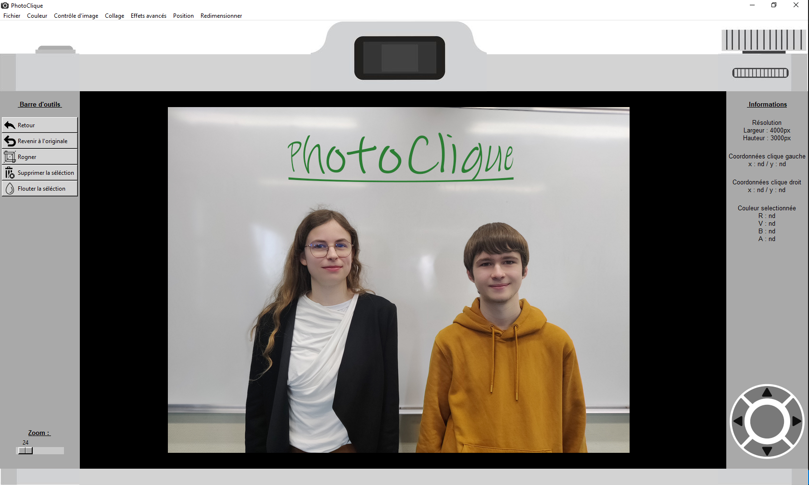

# PhotoClique

# Sommaire
- Description
- Visuels
- Usage
- Instalation
- Lancement du logiciel
- Aide
- Etat actuel du projet
- Auteurs et remerciments
- Licence

# Description
##### **Ce projet a été réalisé pour les " [Trophées NSI](https://trophees-nsi.fr/) " de 2024.**

Le projet PhotoClique offre une gamme de fonctionnalités essentielles pour la retouche photo, accessibles en quelques clics. Il élimine la nécessité d'utiliser des logiciels volumineux pour des opérations standard. Doté d'une interface graphique intuitive et conviviale, cette application se distingue par son aspect pédagogique en évitant l'utilisation de bibliothèques de retouche d'images. Ainsi, les curieux peuvent explorer les coulisses des fonctions et des filtres couramment utilisés. 

# Visuels
Pour une description de chaque fonction par une image et un court résumé voir la documentation (dossier technique). 

# Usage
Avec notre logiciel, vous pouvez retoucher vos photographies au format .png ;.jpg ;.jpeg ;.gif ;.bmp. Il n'y a pas de raccourci avec le clavier seulement des boutons (dans le logiciel) et des clic gauche ou droit de la souris.
Nous vous recommandons de ne pas utiliser d'images trop volumineuses lors de l'utilisation du logiciel, afin d'éviter des temps d'exécution trop longs.

# Installation
Pour utiliser notre logiciel, vous devez disposer d'un interpréteur python. Il n'y a pas de système d'exploitation spécifique requis. Il y a deux modules requis : numpy et pillow pour une installation rapide utiliser le fichier requirement.txt (avec la commande : `pip install -r requirement.txt`)

# Lancement du logiciel
Pour lancer notre logiciel, vous devez ouvrir le répertoire Sources, puis le fichier Main.py et exécuter le fichier python.

# Aide
En cas de problème dans l'exécution de notre logiciel veuillez nous contacter. 

**Mail** : 
- deceuninck.lilian1@gmail.com
- lefetz.chloe@gmail.com

# Etat actuel du projet
Le projet est terminé pour une participation aux Trophées NSI mais peux être repris et complété ultérieurement. 

# Auteurs et remerciments
- **Lilian DECEUNINCK CAPPELAERE**
- **Chloé LEFETZ**
- Notre professeur de NSI : **M. Jouin**

# Licence
Le code du projet est placé sous licence libre GPL v3+ et le texte sous licence
Creative Commons CC By-Sa.